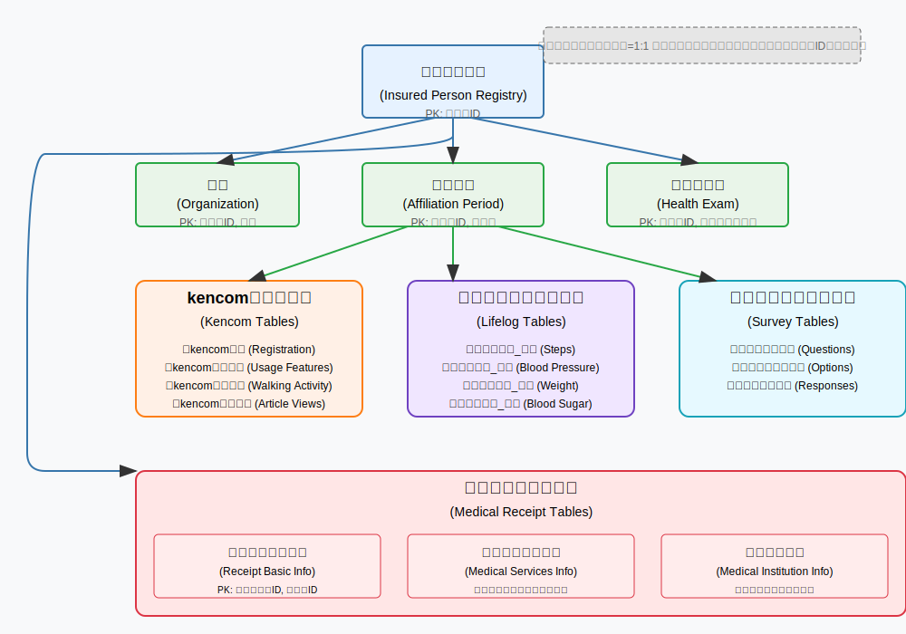

# DeSC
SRWS-PSGで、DeSCの処理コードを共有するためのレポジトリです。マスタ以外のデータや処理済のファイルはこのレポジトリ外で管理してください（.gitignoreで指定）。

# 注意
Clineを使うことを前提に、メモリーバンクを設定しています
https://docs.cline.bot/improving-your-prompting-skills/custom-instructions-library/cline-memory-bank

# マスターデータについて

`master/`フォルダには、分析や処理に必要なマスターデータと関連ドキュメントが格納されています。

## データベース設計資料

- `data定義書_table定義書.xlsx` - テーブル構造と各フィールドの定義情報
- `er_figure.md` - Mermaid形式のER図（関係図）
- `ER図.pdf` - PDFフォーマットのER図
- `healthcare-database-flowchart.svg` - svgフォーマットのER図
  

被保険者台帳を中心として以下のテーブル群が関連付けられています：
- 組織・所属期間
- 健診・問診データ
- kencomテーブル群（登録、利用機能、歩活参加、記事閲覧など）
- ライフログテーブル群（歩数、血圧、体重、血糖など）
- アンケートテーブル群（質問、選択肢、回答）
- レセプトテーブル群（基本情報、医療機関、傷病、医薬品、診療行為）

## マスターデータファイル

ほとんどのファイルは`.feather`形式で保存されています（高速なデータ読み込みが可能なフォーマット）。

### 医療行為関連
- `m_med_treat_all.feather` - 医科診療行為マスター
- `m_med_treat_all_unique.csv` - 医科診療行為マスター（重複なし、CSV形式）
- `m_dental_treat_all.feather` - 歯科診療行為マスター
- `m_spec_equip_all.feather` - 特定器材マスター

### 医薬品関連
- `m_drug_main.feather` - 医薬品メインマスター
- `m_drug_ingredient.feather` - 医薬品成分マスター
- `m_drug_rece_all.feather` - レセプト医薬品マスター
- `m_drug_who_atc.feather` - WHO ATCコードマスター
- `m_drug_ephmra_atc.feather` - EphMRA ATCコードマスター
- `m_dispense_all.feather` - 調剤マスター

### 疾病・診断関連
- `m_disease.feather` - 疾病マスター
- `m_icd10.feather` - ICD-10コードマスター

### 医療機関関連
- `m_hco_med.feather` - 医療機関マスター
- `m_hco_xref_specialty.feather` - 医療機関×診療科クロスリファレンス

### アンケート関連
- `m_survey_question.feather` - アンケート質問マスター
- `merged_m_survey_choice.feather` - アンケート選択肢マスター（マージ済）

### バージョン管理
- `m_version.feather` - マスターバージョン管理
- `m_version_drug.feather` - 医薬品マスターバージョン管理

# 環境設定手順

このプロジェクトでは、データファイルをリポジトリ外部に保存しています。以下の手順で環境を設定できます。

## Clineを使った簡単セットアップ

1. リポジトリをクローンした後、VSCodeでプロジェクトを開きます。
2. Cline拡張機能がインストールされていることを確認します。
3. Clineに以下のように入力するだけで初期設定が完了します：

   ```
   このレポジトリの初期設定をして
   ```

4. Clineが以下の作業を自動的に行います：
   - `.env.example`から`.env`ファイルを作成
   - 必要なPythonパッケージのインストール
   - データディレクトリと出力ディレクトリの設定確認

## 手動での設定

自分で設定する場合は、以下の手順に従ってください：

1. リポジトリをクローンする
   ```bash
   git clone https://github.com/[ユーザー名]/DeSC.git
   cd DeSC
   ```

2. 必要なパッケージをインストールする
   ```bash
   pip install -r requirements.txt
   ```

3. 環境変数ファイルを設定する
   - `.env.example` ファイルをコピーして `.env` ファイルを作成
   ```bash
   copy .env.example .env  # Windowsの場合
   # または
   cp .env.example .env    # Linux/Macの場合
   ```
   - `.env` ファイルを編集し、実際のデータディレクトリと出力ディレクトリを設定
   ```
   # 例：
   DATA_ROOT_DIR=D:\\DeSC_data  # 実際のデータディレクトリパスに置き換え
   OUTPUT_DIR=D:\\DeSC_output   # 実際の出力ディレクトリパスに置き換え
   ```

4. 出力ディレクトリが存在しない場合は作成
   ```bash
   mkdir D:\DeSC_output  # Windowsの場合、実際のパスに置き換え
   ```

## 注意事項

- データディレクトリには、masterフォルダと同様のデータファイルが必要です
- `.env` ファイルはバージョン管理対象外のため、各自の環境に合わせて設定してください
- 大規模データの処理には十分なディスク容量とメモリが必要です

## 既存コードの修正方法

既存のPythonスクリプトでconfig.jsonを直接読み込んでいる場合、以下のように修正してください：

```python
# 変更前
with open('config.json', 'r', encoding='utf-8') as f:
    config = json.load(f)

# 変更後
from data_definition_processing.config_loader import load_config
config = load_config()
```

## トラブルシューティング

- 環境変数が読み込まれない場合は、`.env` ファイルの形式を確認してください
- データディレクトリにアクセスできない場合は、パスが正しいか確認してください
- 出力ディレクトリに書き込めない場合は、権限を確認してください
