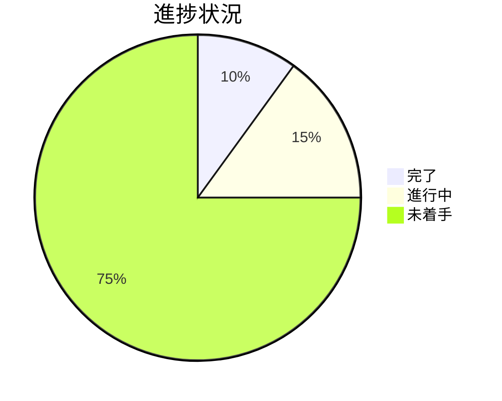
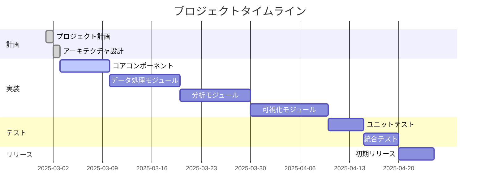

# Progress

## What Works

### 基本インフラストラクチャ
- [x] リポジトリの初期化
- [x] 基本的なREADME.mdの作成
- [x] Clineメモリーバンクの設定

### ドキュメンテーション
- [x] プロジェクト概要の文書化
- [x] システムアーキテクチャの設計
- [x] 技術スタックの定義

## What's Left to Build

### コアコンポーネント
- [ ] ユーティリティモジュールの実装
- [ ] 設定管理システムの構築
- [ ] ロギングフレームワークの統合

### データ処理モジュール
- [ ] データ取り込みコンポーネントの実装
- [ ] データクリーニングユーティリティの開発
- [ ] データ変換パイプラインの構築
- [ ] データエクスポート機能の実装

### 分析モジュール
- [ ] 統計分析ライブラリの統合
- [ ] 機械学習モデルのラッパーの開発
- [ ] 予測アルゴリズムの実装

### 可視化モジュール
- [ ] チャート生成ユーティリティの開発
- [ ] ダッシュボード構築フレームワークの実装
- [ ] レポート生成システムの構築

### テストとCI/CD
- [ ] ユニットテストの作成
- [ ] 統合テストの実装
- [ ] CI/CDパイプラインの設定

### ドキュメンテーション
- [ ] APIドキュメントの作成
- [ ] チュートリアルとサンプルの開発
- [ ] 貢献ガイドラインの作成

## Current Status

現在、プロジェクトは**初期計画段階**にあります。基本的なプロジェクト構造とドキュメンテーションが整備され、Clineメモリーバンクが設定されました。次のステップは、コアコンポーネントの実装と基本的なディレクトリ構造の確立です。

### 進捗状況

### タイムライン

## Known Issues

### 技術的課題
1. **大規模データセットの処理効率**
   - 問題: メモリ使用量の最適化が必要
   - 対策: ストリーミング処理とチャンク処理の実装を検討中

2. **言語間の相互運用性**
   - 問題: Python、R、JavaScriptの統合に課題
   - 対策: 標準化されたデータ交換形式とAPIの設計

3. **依存関係の管理**
   - 問題: 多数の外部ライブラリの互換性維持
   - 対策: 依存関係のバージョン固定と定期的な更新チェック

### 組織的課題
1. **貢献ガイドラインの不足**
   - 問題: 明確な貢献プロセスが未定義
   - 対策: 詳細な貢献ガイドラインの作成を優先

2. **ドキュメンテーションの不足**
   - 問題: 包括的なドキュメントが不足
   - 対策: ドキュメント作成を実装と並行して進める

## Next Milestones

1. **基本ディレクトリ構造の確立** (目標: 2025-03-05)
   - コアモジュールのディレクトリ
   - データ処理モジュールのディレクトリ
   - 分析モジュールのディレクトリ
   - 可視化モジュールのディレクトリ

2. **コアユーティリティの実装** (目標: 2025-03-10)
   - 設定管理
   - ロギング
   - エラー処理

3. **初期データ処理機能の開発** (目標: 2025-03-20)
   - データ読み込み
   - 基本的なデータクリーニング
   - データ変換
