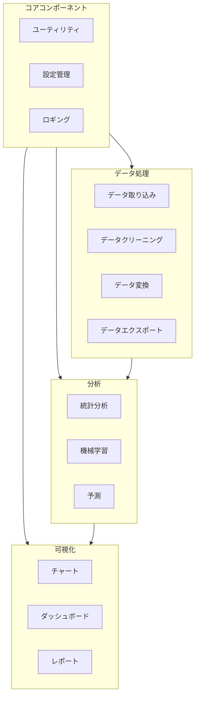
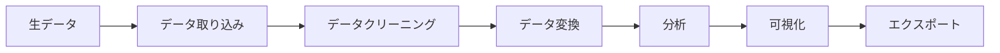
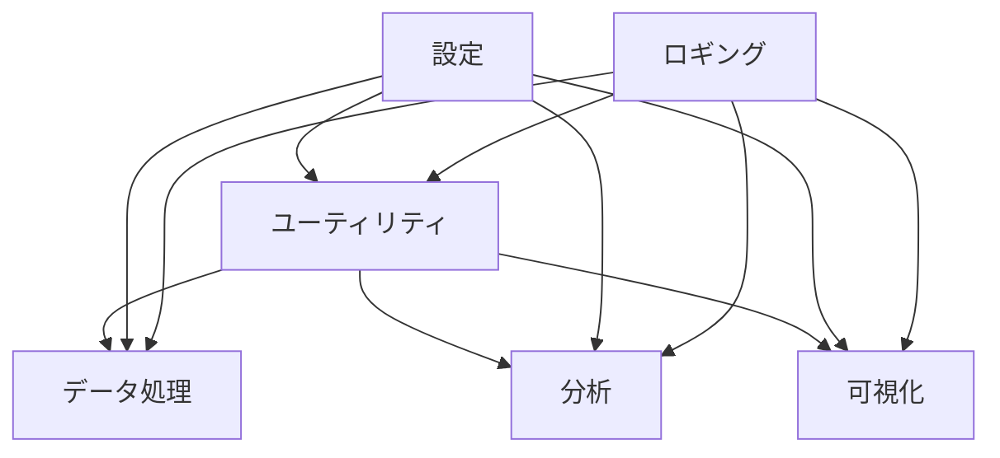
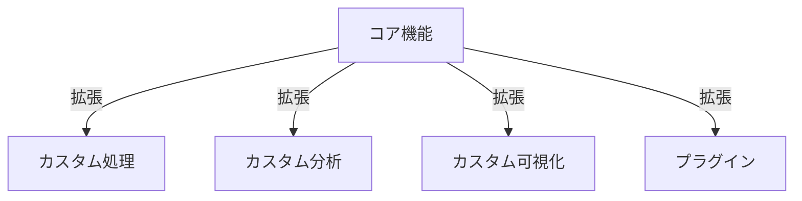

# System Patterns

## System Architecture
DeSCレポジトリは、モジュール化されたコンポーネントベースのアーキテクチャを採用しています。これにより、コードの再利用性、保守性、拡張性を高めることができます。



## Key Technical Decisions

### 1. 言語選択
- **Python**: データ処理、分析、機械学習の主要言語
- **R**: 統計分析と特定の可視化タスク用
- **JavaScript**: インタラクティブな可視化とフロントエンド用
- **SQL**: データベースクエリ用

### 2. 依存関係管理
- 言語固有のパッケージマネージャーの使用
- 依存関係の明示的なバージョン指定
- 仮想環境の使用による分離

### 3. エラー処理
- 一貫したエラーハンドリングパターン
- 詳細なログ記録
- 適切な例外の使用

### 4. パフォーマンス最適化
- 大規模データセット用の効率的なアルゴリズム
- メモリ使用量の最適化
- 並列処理の活用

## Design Patterns

### モジュールパターン
各機能は独立したモジュールとして実装され、明確に定義されたインターフェースを通じて相互作用します。

```python
# モジュールパターンの例
class DataProcessor:
    def __init__(self, config):
        self.config = config
        
    def process(self, data):
        # データ処理ロジック
        return processed_data
```

### ファクトリーパターン
異なるタイプのオブジェクトを作成するための一貫したインターフェースを提供します。

```python
# ファクトリーパターンの例
class VisualizationFactory:
    @staticmethod
    def create_visualization(viz_type, data):
        if viz_type == "bar_chart":
            return BarChart(data)
        elif viz_type == "line_chart":
            return LineChart(data)
        elif viz_type == "scatter_plot":
            return ScatterPlot(data)
        else:
            raise ValueError(f"Unknown visualization type: {viz_type}")
```

### ストラテジーパターン
アルゴリズムを実行時に選択できるようにします。

```python
# ストラテジーパターンの例
class DataCleaningStrategy:
    def clean(self, data):
        pass

class MissingValueImputation(DataCleaningStrategy):
    def clean(self, data):
        # 欠損値の補完ロジック
        return cleaned_data

class OutlierRemoval(DataCleaningStrategy):
    def clean(self, data):
        # 外れ値の除去ロジック
        return cleaned_data
```

### オブザーバーパターン
データや状態の変更を監視し、依存コンポーネントに通知します。

```python
# オブザーバーパターンの例
class DataSource:
    def __init__(self):
        self._observers = []
        self._data = None
    
    def register_observer(self, observer):
        self._observers.append(observer)
    
    def notify_observers(self):
        for observer in self._observers:
            observer.update(self._data)
    
    def update_data(self, new_data):
        self._data = new_data
        self.notify_observers()
```

## Component Relationships

### データフロー


### 依存関係


### 拡張ポイント

